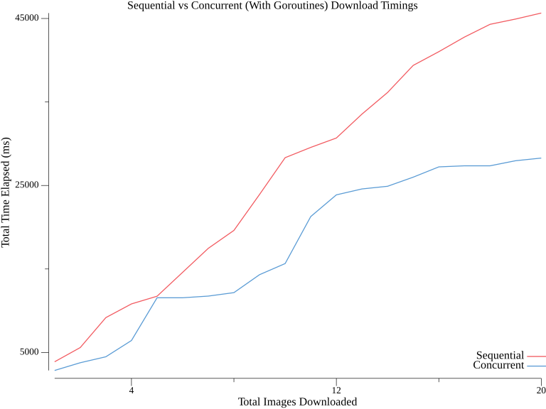

# Testing Go Concurrency with Goroutines

This project compares downloading images one at a time with downloading them concurrently using Go goroutines. It is a three-stage pipeline:

1. `0-url-downloader` gets 20 image URLs from the [Picsum Photos API](https://picsum.photos/).
2. `1-image-downloader` downloads the images sequentially and concurrently, then records timings.
3. `2-plotter` reads the timings and creates a comparison chart.



## Project layout

```text
0-url-downloader/
  img_url.go          Fetches and saves image URLs
  image_urls.txt      Generated URL list

1-image-downloader/
  main.go             Downloads images and records timings
  image_urls.txt      Copy of the URL list
  stats.csv           Timing data

2-plotter/
  plot.go             Creates the timing chart
  stats.csv           Copy of the timing data
  download_timings.png
```

## Running the project

Go 1.22 or newer and an internet connection are required. Each program uses paths relative to its current directory, so run the stages in order and copy the generated files between directories:

```bash
cd 0-url-downloader
go run img_url.go

cd ../1-image-downloader
cp ../0-url-downloader/image_urls.txt .
go run main.go

cd ../2-plotter
cp ../1-image-downloader/stats.csv .
go run plot.go
```

## How the code works

### 1. Fetching URLs: `0-url-downloader/img_url.go`

`main` sets the image count to 20, calls `fetchRandomImageURLs`, and passes the returned URLs to `saveURLsToFile`.

`fetchRandomImageURLs` sends an HTTP request, reads the JSON response, and returns only each image's `download_url`:

```go
type Image struct {
	ID          string `json:"id"`
	Author      string `json:"author"`
	Width       int    `json:"width"`
	Height      int    `json:"height"`
	URL         string `json:"url"`
	DownloadURL string `json:"download_url"`
}

func fetchRandomImageURLs(numImages int) ([]string, error) {
	url := fmt.Sprintf("https://picsum.photos/v2/list?page=2&limit=%d", numImages)
	resp, err := http.Get(url)
	if err != nil {
		return nil, err
	}
	defer resp.Body.Close()

	body, err := io.ReadAll(resp.Body)
	if err != nil {
		return nil, err
	}

	var images []Image
	if err := json.Unmarshal(body, &images); err != nil {
		return nil, err
	}

	var imageURLs []string
	for _, image := range images {
		imageURLs = append(imageURLs, image.DownloadURL)
	}
	return imageURLs, nil
}
```

`saveURLsToFile` creates `image_urls.txt` and writes one URL per line. The next stage reads those lines as individual jobs.

### 2. Downloading images: `1-image-downloader/main.go`

The downloader's `main` function calls the helpers in this order:

1. `createDirectory` creates `sequential_downloads/` and `concurrent_downloads/`.
2. `readURLsFromFile` scans `image_urls.txt` into a `[]string`.
3. `downloadImagesSequentially` downloads all URLs one at a time.
4. `downloadImagesConcurrently` downloads the same URLs with worker goroutines.
5. `saveStatsToCSV` writes both timing slices to `stats.csv`.

Both download modes use `downloadImage` for the actual network and file work:

```go
func downloadImage(url string, dir string) error {
	resp, err := http.Get(url)
	if err != nil {
		return err
	}
	defer resp.Body.Close()

	if resp.StatusCode != http.StatusOK {
		return fmt.Errorf("unexpected status code: %d", resp.StatusCode)
	}

	filePath := filepath.Join(dir, filepath.Base(url))
	file, err := os.Create(filePath)
	if err != nil {
		return err
	}
	defer file.Close()

	_, err = io.Copy(file, resp.Body)
	return err
}
```

This helper checks the HTTP status, derives a filename with `filepath.Base`, creates the destination file, and streams the response body into it with `io.Copy`.

#### Sequential download

`downloadImagesSequentially` calls `downloadImage` inside a normal loop. The next request starts only after the previous one finishes:

```go
start := time.Now()
for _, url := range urls {
	if err := downloadImage(url, dir); err != nil {
		fmt.Printf("Error downloading image %s: %v\n", url, err)
		continue
	}
	timings = append(timings, time.Since(start))
}
totalDuration := time.Since(start)
```

Each timing is cumulative: the value for image 5 includes the time spent downloading images 1 through 5.

#### Concurrent download

`downloadImagesConcurrently` uses `sqrt(number of URLs)` workers. With 20 URLs, it creates 4 workers. A jobs channel delivers URLs to workers, and a `sync.WaitGroup` waits until every worker finishes:

```go
numWorkers := int(math.Sqrt(float64(len(urls))))
var wg sync.WaitGroup
wg.Add(numWorkers)
start := time.Now()

jobs := make(chan string, len(urls))
for i := 0; i < numWorkers; i++ {
	go func() {
		defer wg.Done()
		for url := range jobs {
			if err := downloadImage(url, dir); err != nil {
				continue
			}
			timings = append(timings, time.Since(start))
		}
	}()
}

for _, url := range urls {
	jobs <- url
}
close(jobs)
wg.Wait()
```

The producer sends every URL and closes `jobs`. Each worker ranges over the channel until it is closed, processes its URLs, and calls `wg.Done` through `defer`. Multiple HTTP requests can therefore be active at the same time.

### 3. Saving and plotting timings: `2-plotter/plot.go`

`saveStatsToCSV` converts each `time.Duration` to milliseconds and writes three columns:

```csv
Image,Sequential Time (ms),Concurrent Time (ms)
1,3885.64,2845.90
2,5589.13,3770.31
```

`readDataFromCSV` uses `csv.Reader`, skips the header row, parses the two timing columns as `float64`, and returns sequential and concurrent timing slices.

`plotData` turns each slice into Gonum points. The x-coordinate is the number of images and the y-coordinate is cumulative elapsed time:

```go
for i, elapsedMilliseconds := range seqTimings {
	seqPoints[i].X = float64(i + 1)
	seqPoints[i].Y = elapsedMilliseconds
}
```

It creates one line for each slice, adds a legend, and saves an 8-by-6-inch `download_timings.png` chart.

## Important behavior

- `createDirectory` uses `os.Mkdir` with `0755` permissions and accepts an existing directory.
- `readURLsFromFile` uses `bufio.Scanner`, so each input line becomes one job.
- Timings are cumulative elapsed times, not individual image durations.
- Failed downloads are printed and skipped, so the CSV can contain fewer rows than the input URL file.
- Workers send completed durations through a channel, and the main goroutine builds the timing slice after all workers finish.
- The concurrent total is measured after `WaitGroup.Wait`, so it represents the full worker run rather than the last completed image.

## Generated files

- `0-url-downloader/image_urls.txt`: URLs generated by the API stage.
- `1-image-downloader/image_urls.txt`: URL input used by the downloader.
- `1-image-downloader/sequential_downloads/`: sequential output images.
- `1-image-downloader/concurrent_downloads/`: concurrent output images.
- `1-image-downloader/stats.csv`: timing data from both runs.
- `2-plotter/download_timings.png`: generated comparison chart.

Running the image downloader again overwrites files with the same names and regenerates `stats.csv`.