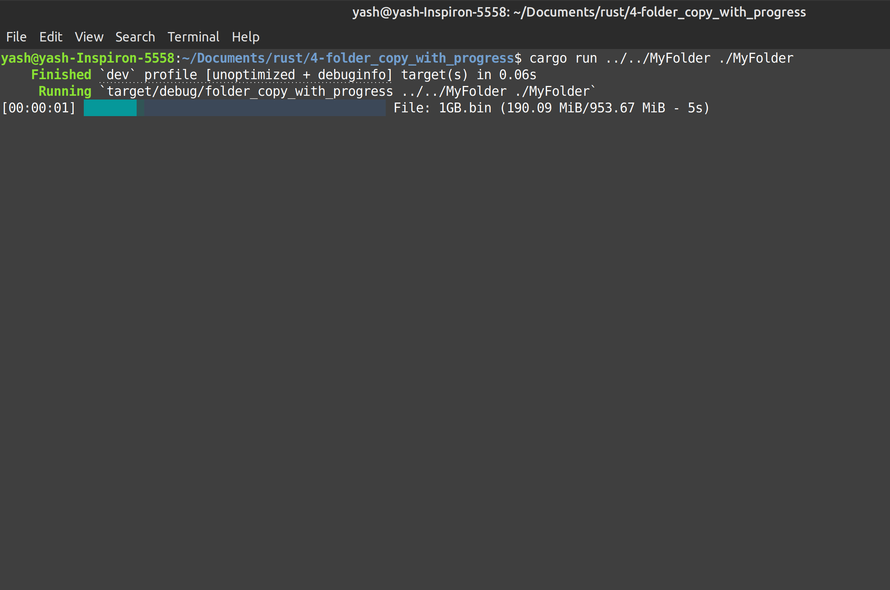

# Rust Folder Copy Projects

This workspace contains a small set of Rust practice programs focused on file and folder operations, progress indicators, and basic command-line tooling.



## Project structure

- `0-hello/` — Minimal Rust program that prints `Hello, World!`
- `1-word_count/` — Small exercise project; the current code actually performs a simple file copy operation
- `2-file_copy/` — Copies one file to another location
- `3-folder_copy/` — Recursively copies an entire directory tree
- `4-folder_copy_with_progress/` — Directory copy with a progress bar for each file

## Documentation

See [explain.md](explain.md) for a step-by-step explanation of the Rust source code.
It is written for JavaScript and TypeScript developers learning Rust and covers:

- ownership, borrowing, references, and resource cleanup
- `Result`, `Option`, `match`, `?`, and error handling
- file and directory input/output
- recursive folder copying and buffered file transfers
- progress-bar timing
- why these programs are synchronous and do not use threads, channels, or synchronization

The explanation follows the current source code, including the fact that `1-word_count/`
currently implements file copying rather than word counting.

## Prerequisites

Install Rust and Cargo if they are not already available:

```bash
rustc --version
cargo --version
```

If these commands fail, install Rust from the official site:

https://www.rust-lang.org/tools/install

## 0. Hello World

This is the simplest example in the project.

Run it with:

```bash
cd 0-hello
rustc main.rs -o hello
./hello
```

Expected output:

```text
Hello, World!
```

## 1. Word Count / File Copy Example

The project folder is named `word_count`, but the source code currently implements a file copy utility rather than a word-count program.

Run it with:

```bash
cd 1-word_count
cargo run -- src/example.txt dest/example.txt
```

If you want a quick test, create a sample file first:

```bash
mkdir -p dest
printf "Example text for copy test\n" > src/example.txt
cargo run -- src/example.txt dest/example.txt
```

## 2. File Copy

This program copies a single file from one path to another.

Run it with:

```bash
cd 2-file_copy
cargo run -- source.txt destination.txt
```

Example:

```bash
printf "A sample file\n" > example.txt
cargo run -- example.txt copied.txt
```

## 3. Folder Copy

This program recursively copies all files and subdirectories from a source folder to a destination folder.

Run it with:

```bash
cd 3-folder_copy
cargo run -- source_dir destination_dir
```

Example:

```bash
mkdir -p source_dir
printf "hello\n" > source_dir/test.txt
cargo run -- source_dir copied_dir
```

## 4. Folder Copy with Progress

This version performs the same recursive directory copy, but also displays a progress bar for each file while it is being copied.

Run it with:

```bash
cd 4-folder_copy_with_progress
cargo run -- source_dir destination_dir
```

Example:

```bash
mkdir -p source_dir
printf "hello world\n" > source_dir/test.txt
cargo run -- source_dir copied_dir
```

## Notes

- The `1-word_count` folder name does not match the current implementation.
- The `4-folder_copy_with_progress` project uses the `indicatif` crate for the progress bar.
- The folder-copy programs do not currently handle special edge cases like file permission errors or symlinks explicitly, but they are suitable for learning basic Rust filesystem operations.

## Suggested next improvements

- Add proper error handling and validation for invalid paths
- Skip or preserve hidden files and symlinks intentionally
- Add file size totals for whole-folder progress
- Rename the `1-word_count` project to better match the actual behavior
