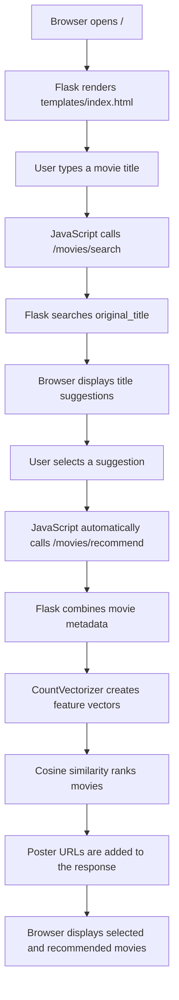

# Movie Recommendation System

A Flask application that recommends movies using content-based filtering. Each
movie is represented by its keywords, cast, genres, and director. The app uses
scikit-learn's `CountVectorizer` and cosine similarity to find movies with
similar content.

## How the application works

The application follows this flow:



### Application startup

1. `app.py` creates the Flask application.
2. Flask registers the movie routes from
	`api/routes/movies/MoviesAPI.py`.
3. Importing `api/algorithms/recommend.py` loads
	`static/movie_dataset.csv` into a pandas DataFrame.
4. Poster information is read from `static/movie_poster.csv` into a dictionary
	keyed by movie title.
5. The HTML page, static JavaScript, CSS, and API routes become available.

The data paths are resolved relative to the project directory, so the app can
be started from another current working directory as long as the project files
are present.

### Searching for movies

As the user types, `static/idx/js/main.js` calls the search endpoint. The API
compares the supplied text with the dataset's `original_title` column and
returns matching titles. Prefix matches are shown first, followed by
case-insensitive substring matches. The browser displays the results as visible,
clickable suggestions.

Selecting a suggestion immediately loads recommendations. The **Find matches**
button remains available for a title typed manually, and pressing Enter does
the same thing.

### Generating recommendations

When the user clicks **Search**, the browser sends the selected title to the
recommendation endpoint. The recommendation algorithm:

1. Fills missing values in `keywords`, `cast`, `genres`, and `director` with
	empty strings.
2. Joins those four fields into one `combined_features` string for each movie.
3. Converts every combined string into a word-count vector using
	`CountVectorizer`.
4. Calculates pairwise cosine similarity between all movie vectors.
5. Finds the vector for the requested movie.
6. Sorts all other movies by similarity, highest first.
7. Adds poster URLs when a matching poster exists.
8. Returns the selected movie first, followed by similar movies.

This is content-based filtering: recommendations are based on movie metadata,
not on user ratings or user history. The similarity matrix is currently built
when a recommendation request is made, so larger datasets may require an
optimization such as caching the matrix.

## Features

- Search for movie titles by prefix or partial text.
- Return similar movies with poster URLs.
- Serve a browser interface from the Flask root route.
- Provide loading, empty, and error messages in the browser UI.
- Work on desktop and mobile screen sizes.
- Expose an interactive Swagger UI at `/swagger`.
- Run locally with Flask or in production with Gunicorn.

## Requirements

- Python 3.12 or a compatible recent Python 3 version
- `pip`
- A virtual environment is recommended

The recommendation dataset is stored in `static/movie_dataset.csv` and poster
data is stored in `static/movie_poster.csv`. Both files are required when the
application starts.

## Installation

```bash
python3 -m venv .venv
.venv/bin/python -m pip install --upgrade pip
.venv/bin/python -m pip install -r requirements.txt
```

## Run locally

Start the Flask development server:

```bash
.venv/bin/python app.py
```

Open <http://127.0.0.1:5000> in a browser. The health check is available at
<http://127.0.0.1:5000/hello>.

For a production-style local server, run:

```bash
.venv/bin/gunicorn app:app
```

## API

### Search movie titles

```text
GET /movies/search?startwith=batman&n=3
```

Example response:

```json
{
	"n": 3,
	"startsWith": "batman",
	"li": [
		"Batman v Superman: Dawn of Justice",
		"Batman Begins",
		"Batman & Robin",
		"Batman Forever"
	]
}
```

The search is case-insensitive and returns prefix matches before partial
substring matches. The endpoint limits the requested result count to 20. The
implementation returns up to `n + 1` matching titles.

The route is implemented by `searchMovieNameStartsWith()` in
`api/routes/movies/MoviesAPI.py`. The query parameters are:

| Parameter | Required | Description |
| --- | --- | --- |
| `startwith` | Yes | Text at the beginning of a movie title |
| `n` | Yes | Requested number of results, limited to 20 by the API |

### Get recommendations

```text
GET /movies/recommend?name=Avatar&n=3
```

Each item in `recommended` contains a movie title and its poster URL:

```json
{
	"n": 3,
	"name": "Avatar",
	"recommended": [
		["Avatar", "https://example.com/avatar.jpg"],
		["Similar Movie", "https://example.com/similar-movie.jpg"]
	]
}
```

The endpoint accepts at most 50 requested recommendations. `name` must match a
movie title in the dataset.

The route is implemented by `getRecommendedMovie()`. Its query parameters are:

| Parameter | Required | Description |
| --- | --- | --- |
| `name` | Yes | Exact movie title from the dataset |
| `n` | Yes | Number of similar movies requested, limited to 50 |

The selected movie is included in the response, so the response can contain
the selected movie plus up to `n` similar movies.

## Swagger documentation

With the server running, open <http://127.0.0.1:5000/swagger> to view the
interactive API documentation. The OpenAPI source is in
`static/swagger.json`.

## Project structure

```text
app.py                              Flask application entry point
api/algorithms/recommend.py        Search and recommendation logic
api/routes/movies/MoviesAPI.py      Movie API routes
static/movie_dataset.csv           Movie metadata used for similarity matching
static/movie_poster.csv            Movie poster URLs
static/idx/                         Browser UI CSS and JavaScript
templates/index.html                Browser UI template
requirements.txt                    Python dependencies
Procfile                            Gunicorn deployment command
```

## Frontend behavior

The page at `/` contains a text input, visible movie suggestions, and a Find
matches button. `static/idx/js/main.js` uses relative URLs (`/movies/search` and
`/movies/recommend`), which means the browser calls the same server that served
the page. This avoids a dependency on an external deployment.

When a user types at least two characters, the UI shows a search progress
message. Choosing a visible suggestion immediately requests recommendations and
shows a recommendation loading message. The results area displays the selected
movie separately from up to four similar movies. The layout includes a mobile
breakpoint for narrow screens and touch-sized controls.

The frontend displays the first recommendation as the selected movie poster
and displays the following recommendations in the results area. Poster images
are loaded from the URLs stored in `movie_poster.csv`, so an unavailable remote
image may appear as a broken image even when the API response is correct.

## Data files

`static/movie_dataset.csv` supplies the recommendation features and movie
titles. The algorithm expects these columns:

- `index`
- `title`
- `original_title`
- `keywords`
- `cast`
- `genres`
- `director`

`static/movie_poster.csv` supplies poster data. Its first three logical fields
are an ID, movie name, and image URL. Some image URLs contain commas, so the
loader preserves the remainder of each row as the URL.

## Notes for local development

The recommendation data is loaded into memory when the application starts, so
the first import may take a moment. If the app is already running on port 5000,
use another port, for example:

```bash
.venv/bin/gunicorn --bind 127.0.0.1:5001 app:app
```

Example:

```bash
curl "http://127.0.0.1:5000/movies/search?startwith=batman&n=3"
curl "http://127.0.0.1:5000/movies/recommend?name=Avatar&n=3"
```

### Troubleshooting

- If the browser shows an old page, hard-refresh it after restarting the
	server. The app serves the latest template and static assets from the local
	project.
- If no suggestions appear, type at least two characters and try a partial
	title such as `avat` or `bat`.
- Use an exact title from the visible suggestions when requesting
	recommendations manually.
- If port 5000 is busy, start Gunicorn on another port with `--bind`, then open
	the matching URL in the browser.
